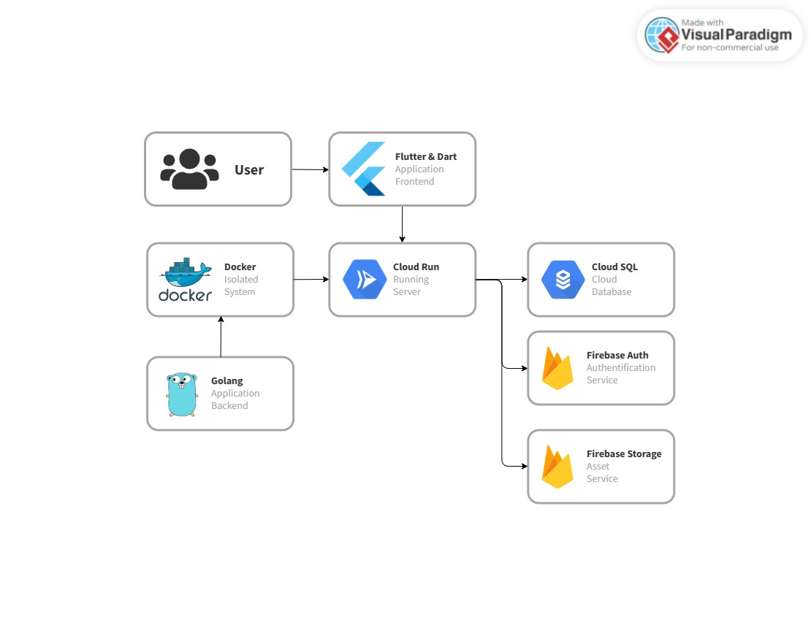

<p align="center">
  <a href="" rel="noopener">
 </a>
</p>

<h3 align="center">Konsultanku-GSC</h3>

<div align="center">

[]()
[](https://golang.org/)
[](https://firebase.google.com/)
[](https://cloud.google.com/)
[](https://www.docker.com/)
[](https://github.com/gofiber/fiber)
[](https://gorm.io/)

</div>

## Architecture🧱
<p align="center">
  <a href="" rel="noopener">
 </a>
</p>

## API Documentation🗄️
### Auth
This API field use for authentification which use firebase one of part google technology
#### Register
- Method : POST
- Endpoint : ```/api/auth/register```
- Header :
  - Content-Type: application/x-www-form-urlencoded
- Request
  - **id**: (string, required) The unique identifier for the item.
  - **name**: (string, required) The name of the item.
  - **price**: (number, required) The price of the item.
  - **quantity**: (integer, required) The quantity of the item.
- Response
```json
{
  "success": {
		"code": "int",
		"data": "string"
  }
}
```

